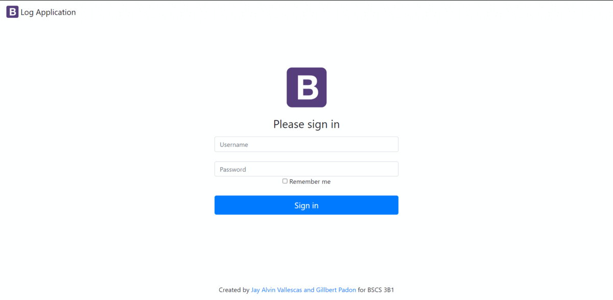
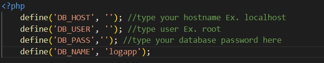
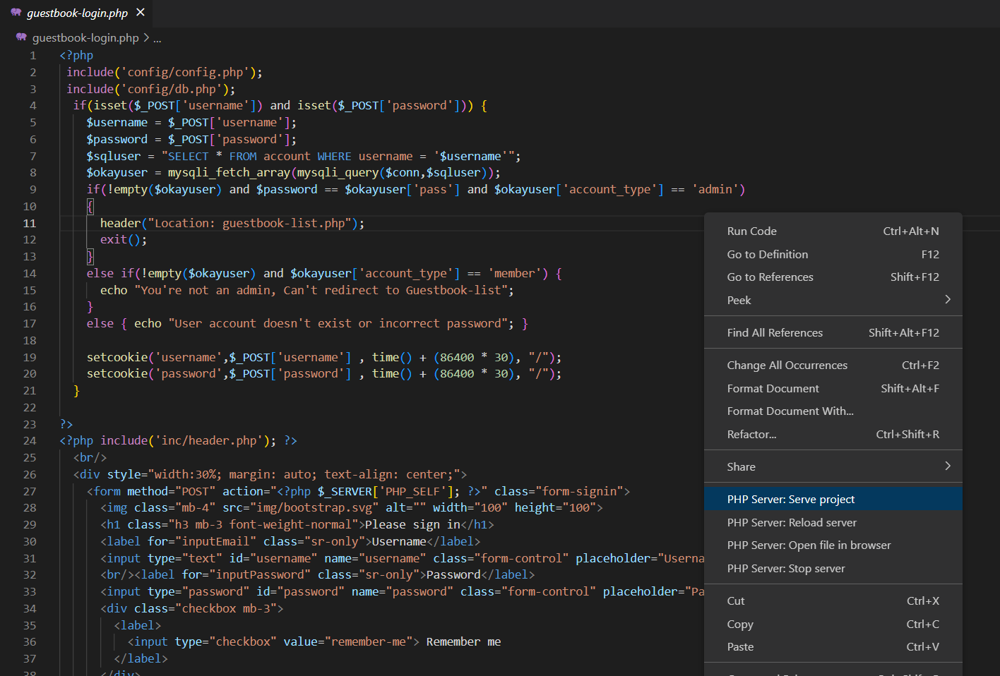
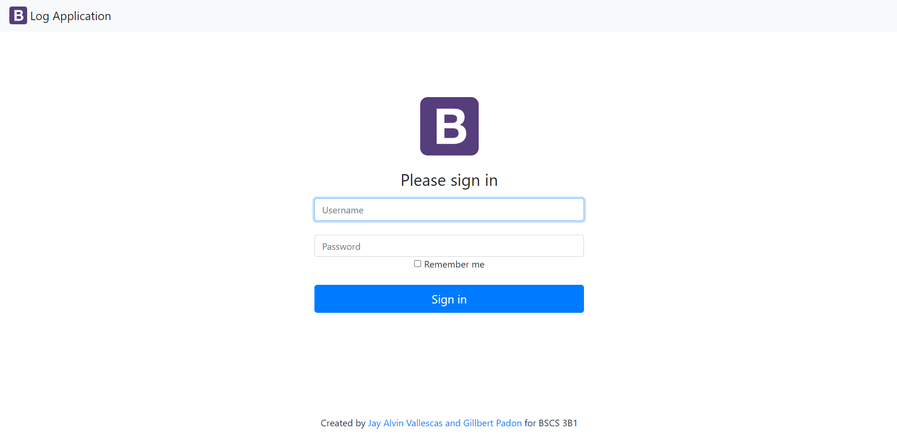
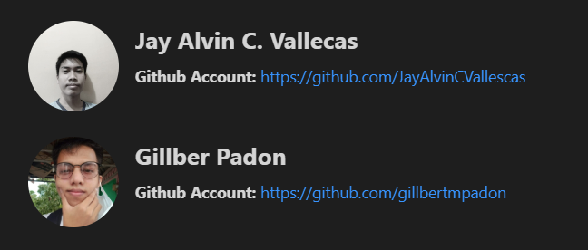

# **VISITOR'S LOG BOOK** :book:

## **Description** :clipboard: 
- The ***Visitor's log book*** is a simple project in which visitors may write their names and other information, such as the date and time they visit the place or site.  
- Visitors can type their personal information in the registration page. However, they cannot access or view the list of logs.   
- Only users that have admin account can view the list of visitor's personal information to ensure it is safe and protected.  
- If the user wants to logout, he/she can click the logout button and the user will be redirected to the login page
  
---
 

>## **Visuals** :camera_flash:
 >

  

---
 

## **Installation** :gear:
If you're interested in this project, you will need the following:
- [Visual Studio](https://code.visualstudio.com/) (Optional) or any IDE's you prefer
- DBMS. I personally prefered this one [MySQL](https://www.mysql.com/products/workbench/)
- Web Servers: [XAMMP](https://www.apachefriends.org/) or [WAMP](https://www.wampserver.com/en/)
- Install PHP Server Extension in VS Code  

### **Quick Start Guide** :zap:
 1. **Clone the repository**

    git clone https://github.com/JayAlvinCVallescas/logApp-scaling-octo.git

    

 2. **Once the repository is cloned, import the database schema named logapp.sql to your MySQL workbench**  
    > **Note:** If you don't know how to import database schema in MySQL Workbench, feel free to check this [Site](https://learn.microsoft.com/en-us/azure/mysql/single-server/concepts-migrate-import-export)
    
 
    
 3. **Modify the config.php file in the config folder inside this repository.**
 
 
 
 4. **Open the guestbook-login.php**

 

 5. **Run the guestbook-login.php to your browser by right-clicking  the guestbook-login file and then select PHP Server: Serve project.**

 

6. **Check if you have the same output as the image shown below** 

  

---
 

> ## **Acknowledgement** :star:
> :pushpin: We would like to acknowledge ma'am [Kristine Joy Martinez](https://github.com/kjvmartinez) for giving us the template for this simple project.  

> ## **Authors** :man_technologist:
>

        
